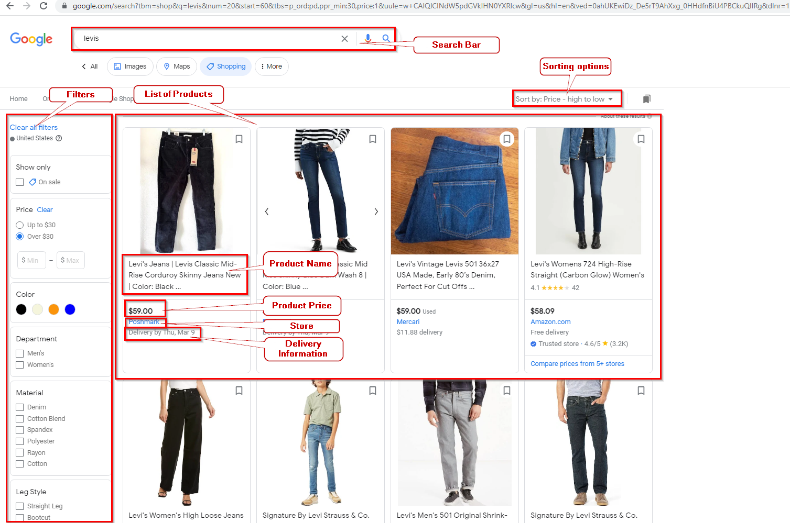
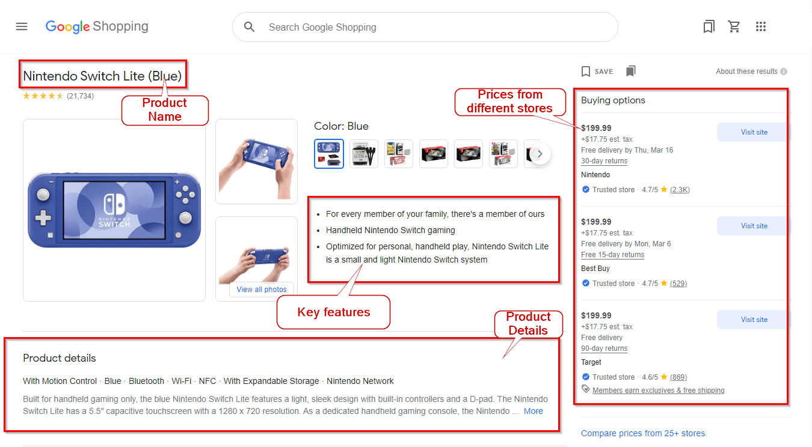
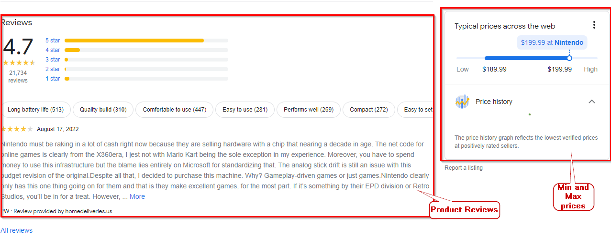
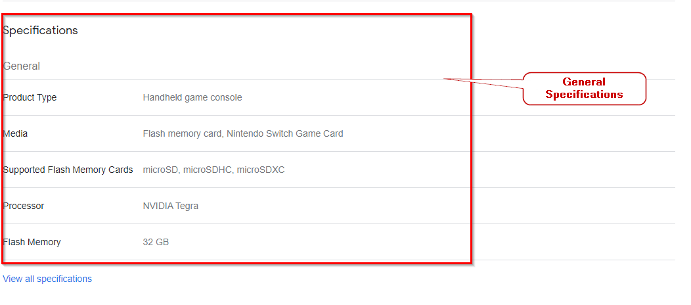
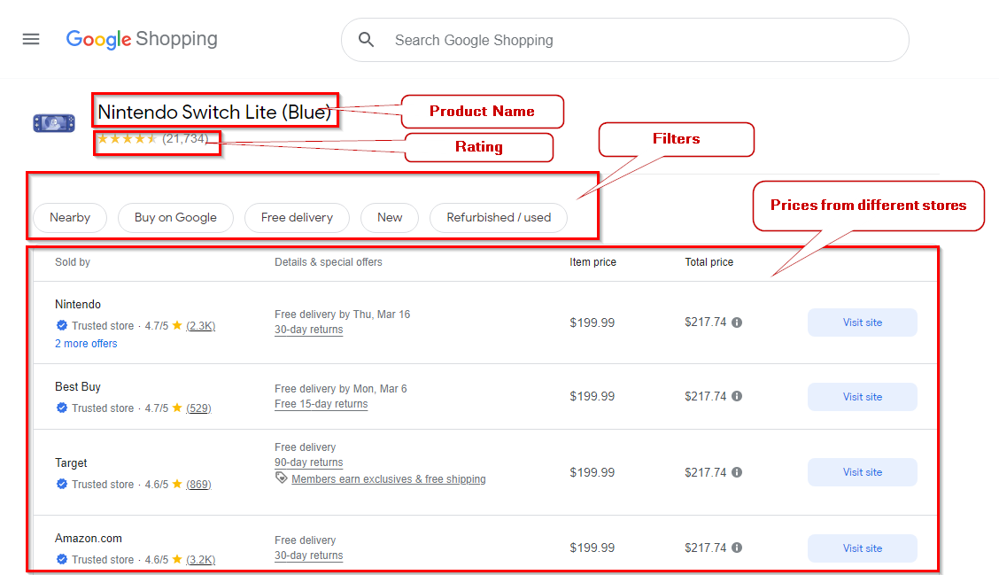
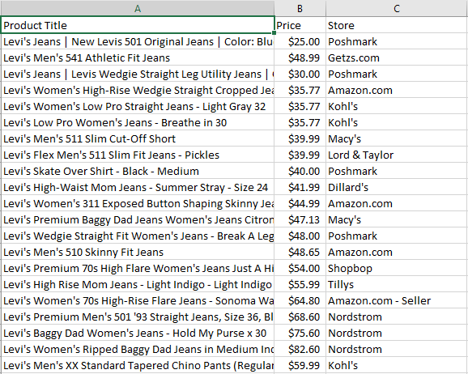
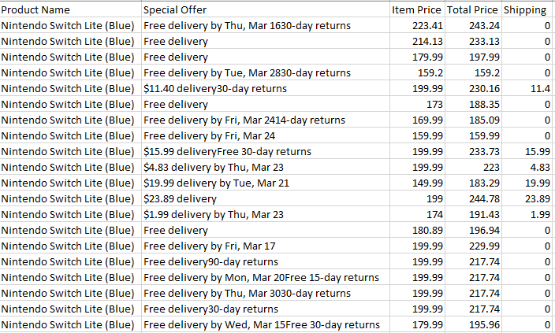

# How to Scrape Google Shopping Results: A Step-by-Step Guide

[](https://oxylabs.go2cloud.org/aff_c?offer_id=7&aff_id=877&url_id=112)

[](https://discord.gg/GbxmdGhZjq)

In today’s competitive business environment, it’s hard to imagine a scenario where an e-commerce company or a retailer stays in demand without turning to web scraping. To shortly answer why, gathering accurate public data from thousands of targets worldwide is what gives them a chance to draw actionable insights and, eventually, present customers with the best deals.

This tutorial will demonstrate how you can scrape publicly-available data from Google Shopping hassle-free. In addition to the guide itself, we’ll shortly cover whether it’s legal to scrape Google Shopping and what difficulties you can encounter in the process.

## What is Google Shopping?

Formerly known as Google Products Search, Google Products, and Froogle, Google Shopping is a service that allows users to browse, compare, and shop for products across different suppliers who have paid to be featured on the website. 

While giving consumers an opportunity to choose the best offers among thousands of brands, Google Shopping is also beneficial for retailers. When a user clicks on a product link, they are redirected to the vendor’s website for purchasing; thus, Google Shopping acts as a solution for businesses to advertise their products online.

More information on how Google Shopping works can be found [here](https://support.google.com/faqs/answer/2987537?hl=en#zippy=%2Cwhat-is-google-shopping). 

## Google Shopping Results page Structure Overview

The data you get when browsing Google Shopping depends on some input parameters: Search, Product, and Price. Let's briefly discuss each of these parameters:

- **Search**: A list of the items on Google Shopping with information about each item, such as its ID, title, description, price, and availability.
- **Product**: Information on a single product's listing along with details about other retailers selling it, and the costs at which it’s offered.
- **Price**: A list of all the product retailers along with the prices they offer and other details like delivery information, total costs, store name, etc. 

### Search Page

The Google Shopping search-results page lists all the relevant items available on Google Shopping for the required product. The below screenshot highlights different attributes of a results page for the query `levis`.  



Let’s discuss all the highlighted parts individually

- **Search Bar**: This search bar allows you to search for any product on Google Shopping. 

- **List of Products**: This section lists all the products and the details of the searched product. 

- **Filters**: This section allows you to apply any filter to your search, for example, price range, color, style, etc. 

- **Sorting Options**: This drop-down list will enable you to sort your search on multiple attributes, for example, increasing price, decreasing price, popularity, etc.

- The list of products shows an individual product with the following product attributes:

- - Product Name
  - Price 
  - Name of the retailer or store
  - Delivery Information

### Products Page

When you select a specific item from the search page, you are directed to the Products page. This page contains detailed information about that particular product, such as its pictures, key features, product details, product reviews, retailers and prices information, and much more. 







- **Product name**: Title of the product. 
- **Product Highlights**: Main features to have a quick overview of the product.
- **Product details**: Detailed description of the product.
- **Prices**: List of different retailers and their prices. 
- **Product reviews**: Product rating and customer reviews. 
- **Min and max prices**: Product’s minimum to maximum pricing range sold by different sellers.
- **General specifications**: General information about the product. 

### Pricing Page

This page lists all the prices of different retailers’ products. This page also shows if a store or retailer is a trusted one or not. Moreover, it gives information if the retailer has a Google Guarantee. 

Let’s look at the screenshot of the page highlighting its different parts and discuss them individually. 

 


- **Product Name**: shows the name of the searched product.
- **Rating**: This shows the overall rating of the product and the number of reviews. 
- **Prices from Different Stores**: This is a list of retailers, along with their offers, prices, and the link to visit their website to buy the product. 
- **Filters**: These filters can be applied to the retailers’ list. 

## Is it Legal to Scrape Google Shopping Results?

In general, web scraping is considered to be legal as long as you strictly follow all the regulations surrounding the public data you wish to gather. However, we still recommended seeking professional legal advice to rule out any possible risks.

If you wish to dive deeper into the topic of web scraping legality, check out our extensive [blog post](https://oxylabs.io/blog/is-web-scraping-legal).

## The pain of scraping Google Shopping

Though doable, scraping Google Shopping might not be the easiest task to take on. Not only is Google Shopping good at detecting automated requests but it also requires parsing JavaScript, which is an “expensive” operation that slows down the scraping process. 

Therefore, to make sure you effortlessly scrape and parse a variety of Google Shopping page types, it’s best to rely on a high-quality scraping solution, such as [Oxylabs’ Google Shopping API](https://oxylabs.io/products/scraper-api/ecommerce/google-shopping). This scraper API is specifically designed to deal with the challenges Google scraping processes and lets you gather accurate real-time data globally.

## Step-by-Step guide for scraping Google Shopping results using Google Shopping API
In this section, we will have a step-by-step guide to developing the code for scraping Google Shopping Results Page using the Oxylabs' [Google Shopping Scraper API ](https://developers.oxylabs.io/scraper-apis/e-commerce-scraper-api/google-shopping) and Python. 

### **Step - 1: Setting up the environment**

You must have Python 3.6+ installed on your system. Then, you need to install the following packages to code the scraper. 

- `Requests` - to send the request to the API.
- `Pandas` - to populate the data in the DataFrame data structure. 

To install the packages, use the following command:

|pip install requests pandas|
| :- |

This will install all the required packages. 

### Step - 2: Code in action

This section will discuss the coding steps for all three types of pages of Google Shopping API.  

#### Search Page
1. The first step is creating a structure payload containing different query parameters. Below is a list of the query parameters and their brief description. 

2. After the payload structure is ready, you can create the request by passing your authentication key.
3. We will extract the Product Title, Price, and Store name from the response. Since we made the payload parameter `parse:true` the response will be auto-parsed in the JSON format. We can extract product information from the [JSON response](https://developers.oxylabs.io/scraper-apis/e-commerce-scraper-api/google-shopping/structured-data#google_shopping_search-structured-output) without using any external parser.
4. Then we created a DataFrame object that will save all the extracted data. We can print this DataFrame or write it in CSV or JSON files.

The complete code is as follows.

```python
import pandas as pd
import requests

# Structure payload
payload = {
   'source': 'google_shopping_search',
   'domain': 'com',
   'query': 'levis',
   'pages': 1,
   'context': [
       {'key': 'sort_by', 'value': 'pd'},
       {'key': 'min_price', 'value': 30},
   ],
   'parse': 'true',
}

# Get response
response = requests.request(
   'POST',
   'https://realtime.oxylabs.io/v1/queries',
   auth=('username', 'password'),
   json=payload,
)

#Get the content from the response
result=response.json()['results'][0]['content']
products = result['results']['organic']

#Create a DataFrame
df = pd.DataFrame(columns=['Product Title', 'Price', 'Store'])

#iterate through all the products
for p in products:
   title = p['title']
   price = p['price_str']
   store = p['merchant']['name']
   df = pd.concat([pd.DataFrame([[title, price, store]], columns=df.columns),
                   df], ignore_index=True)

#Copy the DataFrame to CSV and JSON files
df.to_csv('google_shopping_search.csv', index=False)
df.to_json('google_shopping_search.json', orient='split', index=False)

```

The output will be sent to the CSV file. The screenshot below shows an extract of the complete CSV file. 



#### Product Page
1. First, the payload structure will be created using different product page parameters. Below is a list of the query parameters and their brief description. 
2. After the payload structure is ready, you can create the request by passing your authentication key.
3. We’ll extract the Product Title, Product Details, and Product Highlights from the response received. Like in the previous section, we’ll use JSON response and extract our desired information.
4. Then, we created a DataFrame object to save all the extracted data. We can print this DataFrame or write it in CSV or JSON files.


The complete code will be as follows:  

```python
import pandas as pd
import requests

# Structure payload.
payload = {
  'source': 'google_shopping_product',
  'domain': 'com',
  'query': '4505166624001087642',
  'parse': 'true',
}

# Get response.
response = requests.request(
  'POST',
  'https://realtime.oxylabs.io/v1/queries',
  auth=('username', 'password'),
  json=payload,
)

# Get the content
product=response.json()['results'][0]['content']

# create a DataFrame
df = pd.DataFrame(columns=['Product Title', 'Product Details',
                          'Highlights', 'Rating', 'Reviews Count'])

# Get the elements from the response object
title = product['title']
details = product['description']
highlights = product['highlights']
rating = product['reviews']['rating']
reviews_count = product['reviews']['reviews_count']

# Add all the elements in DataFrame
df = pd.concat([pd.DataFrame([[title, details, highlights, rating, reviews_count]],
                           columns=df.columns), df], ignore_index=True)

# Copy the data in CSV and JSON file
df.to_csv('google_shopping_product.csv', index=False)
df.to_json('google_shopping_product.json', orient = 'split', index = False)

# Print the data on screen
print ('Product Name: ' + title)
print ('Product Details: ' + details)
print ('Product Highlights: ' + str(highlights))
print ('Product Rating: ' + str(rating))
print ('Reviews Count: ' + str(reviews_count))

```

The output will be as follows:


#### Pricing Page

1. First, the payload structure will be created using different parameters for the pricing page. 
2. After the payload structure is ready, you can create the request by passing your authentication key.
3. We’ll be extracting Product Name, Special Offer, Item Price, Total Price, and Shipping charges from the JSON response received. You can find the structure of the JSON response [here](https://developers.oxylabs.io/scraper-apis/e-commerce-scraper-api/google-shopping/structured-data#google_shopping_pricing-structured-output). 
4. After that, we created a DataFrame object to save all the extracted data. We write the DataFrame in CSV or JSON files easily.


Let's look at the complete code and its corresponding output:

```python
import pandas as pd  # include the pandas library for DataFrame
import requests  # Include the requests library

# Structure payload.
payload = {
   'source': 'google_shopping_pricing',
   'domain': 'com',
   'query': '4505166624001087642',
   'parse': 'true'
}

# Get response.
response = requests.request(
   'POST',
   'https://realtime.oxylabs.io/v1/queries',
   auth=('username', 'password'),
   json=payload,
)

# Get the content from the response
result = response.json()['results'][0]['content']
title = result['title']
pricing = result['pricing']
# Create a DataFrame
df = pd.DataFrame(columns=['Product Name', 'Special Offer',
                          'Item Price', 'Total Price', 'Shipping'])

for p in pricing:
   offer = p['details']
   item_price = p['price']
   total_price = p['price_total']
   shipping = p['price_shipping']
   df = pd.concat([pd.DataFrame([[title, offer, item_price,
                                  total_price, shipping]], columns=df.columns), df],
                  ignore_index=True)

# Copy the DataFrame to CSV and JSON files
df.to_csv('google_shopping_pricing.csv', index=False)
df.to_json('google_shopping_pricing.json', orient='split', index=False)

```

The output CSV will look like this:



## Conclusion
Scraping Google Shopping is essential if you’re looking to retrieve accurate data on your biggest competitors’ products and prices and make data-driven decisions to scale your business. We hope this tutorial was clear and will contribute to more effortless and smooth data-gathering activities. But in case you still have any questions, don’t hesitate to [contact us](mailto:hello@oxylabs.io) – Oxylabs’ professional team is always ready to assist you. 

